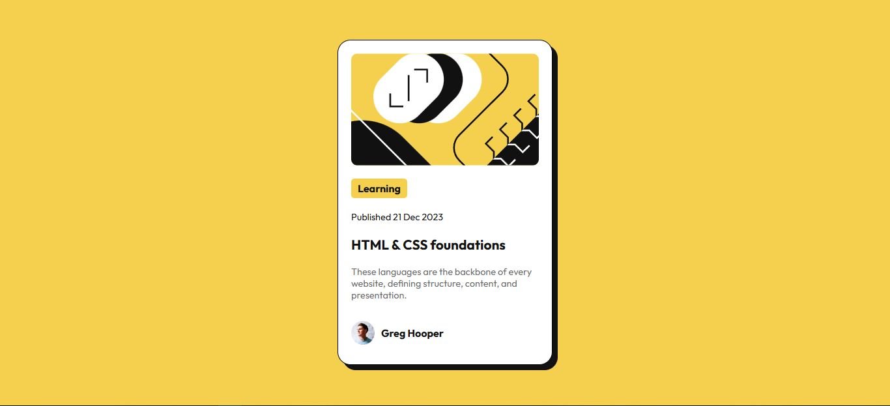

# Frontend Mentor - Blog preview card solution

This is a solution to the [Blog preview card challenge on Frontend Mentor](https://www.frontendmentor.io/challenges/blog-preview-card-ckPaj01IcS). Frontend Mentor challenges help you improve your coding skills by building realistic projects. 

## Table of contents

- [Overview](#overview)
  - [The challenge](#the-challenge)
  - [Screenshot](#screenshot)
  - [Links](#links)
- [My process](#my-process)
  - [Built with](#built-with)
  - [What I learned](#what-i-learned)
- [Author](#author)

## Overview

### The challenge

Users should be able to:

- See hover and focus states for all interactive elements on the page

### Screenshot



### Links

- Solution URL: [Click Here](https://your-solution-url.com)
- Live Site URL: [Click Here](https://giodosvani.github.io/blog-preview-card-main-frontendmentor/)

## My process

### Built with

- Semantic HTML5 markup
- CSS custom properties
- Flexbox
- Mobile-first workflow

### What I learned

In this challenge, i learned that even using "height: 100vh" on CSS, you can still face these rolling bars. To solve it, you can add a section on your document telling that your HTML and Body need margin and padding
: 0, or simply add it in your universal section


```css (Universal section way)
* {
    padding: 0px;
    margin: 0px;
}
```
```css (HTML and body way)
body, html {
    min-height: 100vh;
    max-width: 100vw;
    margin: 0;
    padding: 0;
}
```

## Author

- Website - [Giovani Oliveira](https://giodosvani.github.io/portfolio)
- Frontend Mentor - [@Giodosvani](https://www.frontendmentor.io/profile/Giodosvani)
